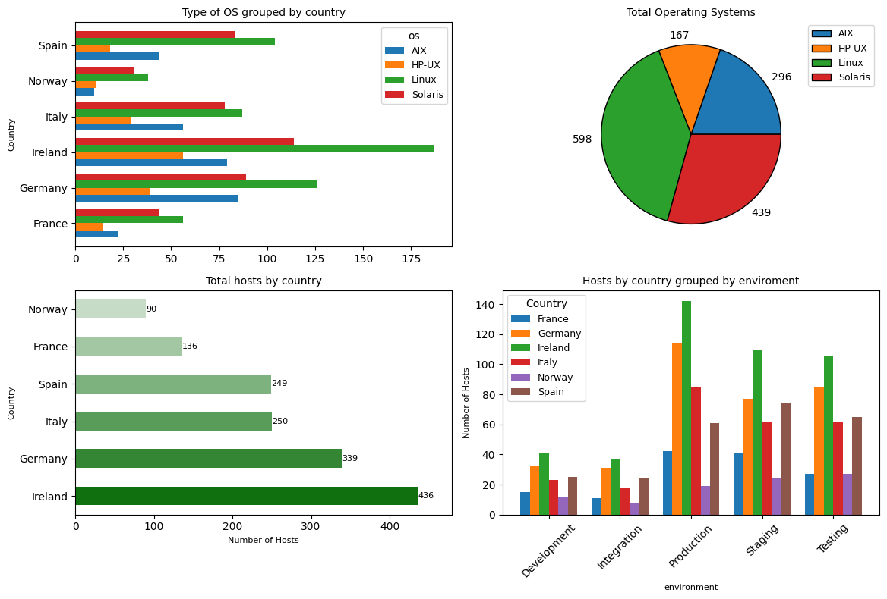

# Hosts Data Analysis Project

Este proyecto de análisis de datos genera y analiza un conjunto de datos ficticio de servidores (hosts) en diferentes países, sistemas operativos y entornos, para mostrar cómo se distribuyen estos servidores en varias combinaciones de configuraciones.

## Estructura del Proyecto

El código está estructurado en una serie de funciones en Python, con un enfoque en el uso de `pandas` y `matplotlib` para manipular y visualizar los datos.

### Archivos principales:
- **main_script.py**: Contiene todas las funciones y el flujo principal del programa.
- **hosts.csv**: Archivo de salida generado, que contiene los datos creados por el programa.
- **README.md**: Instrucciones y detalles sobre el proyecto.

## Funciones Clave

1. **`gen_node_dict`** *(opcional)*: Genera un diccionario con identificadores de nodos únicos para cada combinación de país, sistema operativo y entorno.
2. **`set_hostnames(number_of_hosts)`**: Genera un conjunto de nombres de host (hostnames) en base a combinaciones de sistema operativo, entorno y país, asignando un identificador de nodo único a cada uno.
3. **`set_dataframe(count)`**: Crea un DataFrame con el número de registros especificado, llamando a la función `set_hostnames` y llenando una lista de diccionarios con la información de cada host.
4. **`get_os(hostname)`, `get_environment(hostname)`, `get_country(hostname)`**: Extraen información de sistema operativo, entorno y país desde cada hostname.
5. **`generate_csv()`**: Guarda el DataFrame generado en un archivo CSV llamado `hosts.csv`.
6. **Visualización**: Muestra un gráfico de barras que compara la distribución de entornos en cada país, utilizando `matplotlib`.

## Ejecución del Proyecto

1. Clonar el repositorio:
    ```bash
    git clone https://github.com/tu_usuario/hosts-data-analysis.git
    cd hosts-data-analysis
    ```

2. Instalar las dependencias (si es necesario):
    ```bash
    pip install pandas matplotlib
    ```

3. Ejecutar el script principal:
    ```bash
    python main_script.py
    ```

4. Visualizar el archivo CSV generado:
    ```python
    import pandas as pd
    hosts_df = pd.read_csv('hosts.csv')
    print(hosts_df.head())
    ```

## Visualización de los Datos

El script crea un gráfico de barras apiladas para visualizar los entornos en diferentes países, que es una excelente forma de analizar la distribución de servidores en función del país y el entorno. Los gráficos se generan con `matplotlib` y se almacenan localmente.

### Ejemplo de Gráfico


## Contribuciones

Este es un proyecto de aprendizaje. Las contribuciones son bienvenidas para expandir las funcionalidades o mejorar la eficiencia del código. 

1. Hacer un fork del proyecto
2. Crear una nueva rama (`git checkout -b feature/nueva-funcionalidad`)
3. Realizar un commit de tus cambios (`git commit -am 'Agrega nueva funcionalidad'`)
4. Subir la rama (`git push origin feature/nueva-funcionalidad`)
5. Crear un Pull Request

## Licencia

Este proyecto está bajo la Licencia MIT. 

---

¡Gracias por explorar este proyecto de análisis de datos de hosts!
